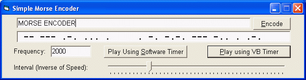



## MORSE Encoder and Player

### Description

MORSE ENCODER

-- --- .-. ... .  . -. -.-. --- -.. . .-.

This project is especially for all those HAMs who wanted to make their own Morse

encoder but were unable to find resources (tutorials / examples) for doing so.

The whole code is heavily commented so even a beginner can understand all of it.

And it's so simple, you'll wonder how it never came to your mind! Anyway we are

a community for this same reason... someone gets the idea which everyone can use.

This app does it all... encodes any sentence into dots and dashes (Morse Code)

and then also plays it back on the PC Speaker!

Also included is a module which makes it even more easier for you to integrate

the functions with your application. I have used two methods for playing back

the sound... use whichever you find easy / reliable.

I am working on a new version which will play back sound through the main

speakers. If anyone happens to know how to do it, any help will be appreciated!

Thanks for reading, and please vote for me!
 
### More Info
 
simple sentence

Morse encoded text or alternatively sound through the PC Speaker

While using the software timer, your PC may s;low down too much!!! So use software timer only if you have a 333 MHz or better Processor, other stik to the VB Timer

             |
---                |---
**Submitted On**   |2002-07-01 01:16:16
**By**             |[Harshad Sharma \(aka Datamatrix\)](https://github.com/Planet-Source-Code/PSCIndex/blob/master/ByAuthor/harshad-sharma-aka-datamatrix.md)
**Level**          |Intermediate
**User Rating**    |4.9 (44 globes from 9 users)
**Compatibility**  |VB 6\.0
**Category**       |[Sound/MP3](https://github.com/Planet-Source-Code/PSCIndex/blob/master/ByCategory/sound-mp3__1-45.md)
**World**          |[Visual Basic](https://github.com/Planet-Source-Code/PSCIndex/blob/master/ByWorld/visual-basic.md)
**Archive File**   |[MORSE\_Enco1003356302002\.zip](https://github.com/Planet-Source-Code/harshad-sharma-aka-datamatrix-morse-encoder-and-player__1-36390/archive/master.zip)

